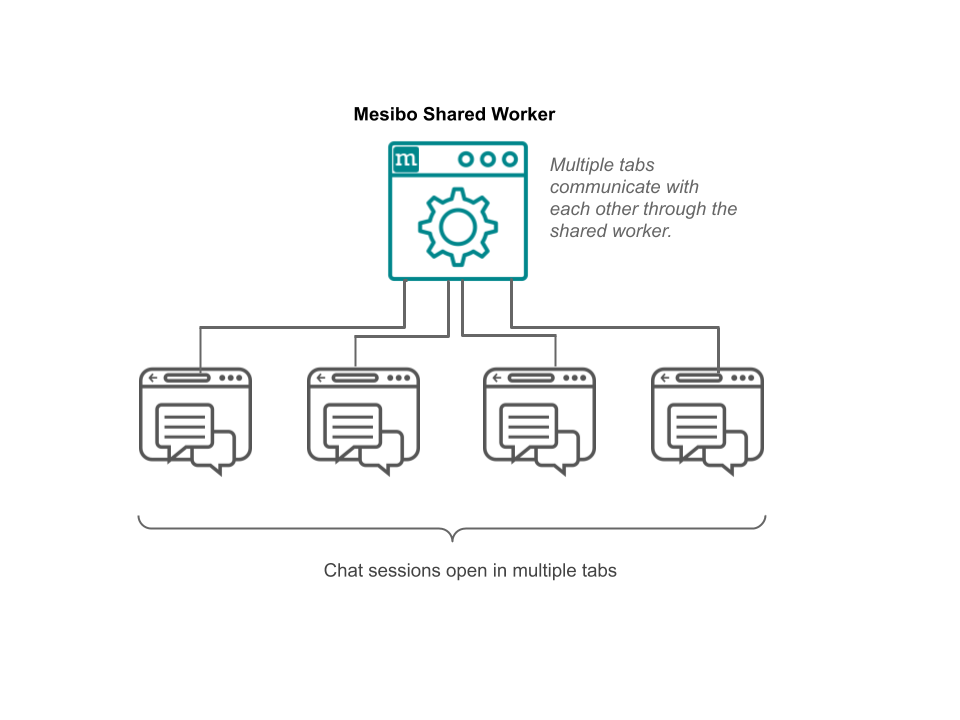
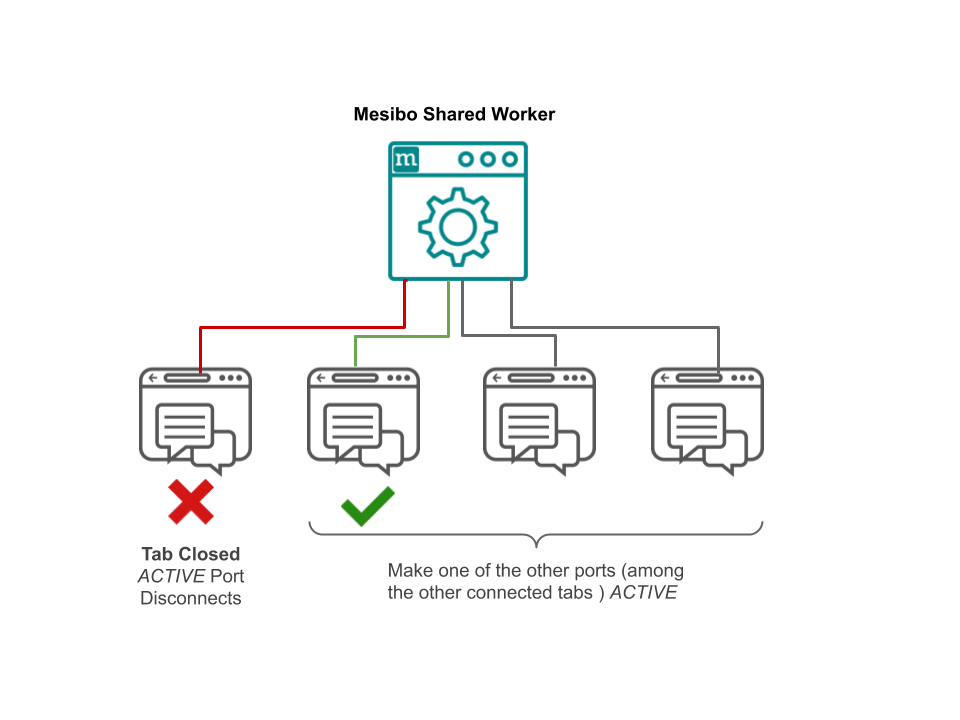

## Multi-Tab Chat Popup [BETA]
This repository contains the source code for a multi-tab, Mesibo Messenger Popup app using Mesibo Javascript API.

**For the single-tab version refer https://github.com/mesibo/messenger-javascript**

This multi-tab popup has the same features as of the single-tab version with one added feature — the chat popup can be opened and viewed in multiple tabs. This is done by using a [Shared Worker](https://developer.mozilla.org/en-US/docs/Web/API/SharedWorker). 

## Features:
- Multi-tab support
- One-to-One Messaging, Voice and Video Call
- Group Messaging
- Read receipts
- Send Files
- Record and Send live audio from microphone
- Send photos captured live using Webcam
- Chat history
- Link Preview
- On-Demand read and sync


## Multi-tab Sessions 
In the case of the singe-tab version, if you are connected to mesibo on one tab and try to connect on another tab, using the same credentials (token and app id) you will be **logged out** from the first tab. This is because for a mesibo user there can only be one active session logged in.

So, if you want to open up multiple chat sessions, for the same user, across multiple tabs this approach is not feasible. To solve this you can use a [Shared Worker](https://developer.mozilla.org/en-US/docs/Web/API/SharedWorker).  

## Using a Shared Worker
With a shared worker, you still have a single connection to mesibo. Instead of each tab connecting to mesibo individually, the shared worker is the only one handling the connection to mesibo. Incoming & outgoing messages, calls, etc will be handled by the shared worker across all connected tabs which communicate with each other through the shared worker using message events.

- `scripts/mesibo-shared.js` is the **shared worker script**. 

- `scripts/mesibo-worker.js` provide a wrapper interface to Mesibo APIs using a shared worker. 
`index.html` includes `scripts/mesibo-worker.js`



Every time you open `index.html` in a tab, a `MesiboWorker` object will be created(See `initMesibo()` in `controller.js`) which in turn creates a `SharedWorker` object(which executes `mesibo-shared.js`). At each tab, you can call Mesibo API functions and callbacks, which will be handled by the `MesiboWorker` by sending appropriate messages to the shared worker.

## Connecting to the shared worker

Every tab(`MesiboWorker`) connects to the shared worker through a port. When the port is started, each script posts messages to the worker and handle messages sent from it using `port.postMessage()` and `port.onmessage`, respectively. 
```javascript
//mesibo-shared.js
onconnect = function(event) {
	var port = event.ports[0];

	console.log("shared onconnect: ", ports, ports.length);
	ports.push(port);
	port.start();

	port.addEventListener("message", function(event) { 
		message_handler(event, port); 
	} );
}
```
When you call `MesiboWorker.start`, a `start` message is sent to the shared worker
```javascript
//mesibo-worker.js
MesiboWorker.prototype.start = function(){
	var post = {op: "start"};
	this.mesibo_worker.port.postMessage(post);
}
```
On the shared worker end, we will then initialize mesibo
```javascript
//mesibo-shared.js
if(op == "start"){		
		send_mesibo_init(port);
	}

send_mesibo_init = function(port) {
	if(mesibo_api_init) {
		mesibo_api_init = false;

		//initialize mesibo
		send_to_port(port, "init", null);
		active_port = port;
	}
}
``` 
We will only initialize and connect to mesibo once — when a tab connects for the first time. After that, the tab that connected via that port is set to be **active**. This active mesibo port is used to connect to mesibo, send messages, make calls, etc directly through Mesibo APIs.

### Sending Messages
For example, to send a message you call the `sendMessage` function and a message is posted to the shared worker for a `sendMessage` operation.
```javascript
//mesibo-worker.js
MesiboWorker.prototype.sendMessage = function(p, id, m){
	var post = {op: "sendMessage", id: id, message: m, params: p};
	this.mesibo_worker.port.postMessage(post);
}
```

The shared worker receives this message and forwards the message parameters to the active port. Also, all the other connected tabs will be notified of the message sent through a `Mesibo_OnMessage` callback.

```javascript
//mesibo-shared.js

if(op == "sendMessage") {
	// send it to active port to send message 
	send_to_port(active_port, null, data);

	//Inform all the tabs about new message
	var p = {};
	p.m = data.params;
	p.data = new TextEncoder().encode(data.message);

	console.log("inform everyone..", p);
	send_to_all("Mesibo_OnMessage", p);
}
```
Now, only the active port will get the `sendMessage` call and will inturn call Mesibo API function `sendMessage` to the required destination.
```javascript
//mesibo-worker.js

case "sendMessage": 
	// send message for this and other tab
	if(this.mesibo_api)
		this.mesibo_api.sendMessage(o.params, o.id, o.message);
	break;

```

### Receiving Messages
Similar to sending messages being handled by the active port, only the active port will receive the messages from Mesibo through the `Mesibo_OnMessage` callback. The active port must forward this to all other connected ports. The active port connected to mesibo, forwards all such data(like `Mesibo_OnConnectionStatus`, `Mesibo_OnMessageStatus`, etc) received through callbacks.

```javascript
//mesibo-worker.js
MesiboNotifyForward.prototype.Mesibo_OnMessage = function(m, data) {
	console.log("Forwarding Mesibo_OnMessage: from "  + m.peer + " id: " + m.id);
	var p = {op: "Mesibo_OnMessage", data:{'m':m, 'data': data} };
	this.worker.port.postMessage(p);
	this.client_notify.Mesibo_OnMessage(m, data);
}
```

Once the shared worker gets this it sends it to all connected ports.
```javascript
//mesibo-shared.js
if(op.startsWith("Mesibo_On")) {
	send_to_all(null, data);
}
```

## Switching the active port
After opening a chat session in multiple tabs, you may choose to close a tab. You may also close the active tab. In such a scenario, you will lose the connection to mesibo as it is the only one connected. So, you need to make one of the other connected tabs active and connect to mesibo using that so that you can continue to send messages and make calls on all your tabs.

 

When a tab is closed, you send a `private_close` message to the shared worker. 
```javascript
addEventListener( 'beforeunload', function() {
	    worker.port.postMessage( {op:'private_close'} );
});
```

On the shared worker end, if you receive a `private_close` message from the active port you need to make one of the ports to be active and initialize mesibo on that port.

```javascript
//mesibo-shared.js
if(op == "private_close") {
	console.log("private_close", "port is closed");

	ports.splice(ports.indexOf(port), 1);

	/* if the active port is closed, reconnect using another port/tab */
	if(port == active_port) {
		mesibo_api_init = true;
		if(ports.length) {								
			console.log("active port closed. Reconnect using another port/tab", ports[0]);
			send_mesibo_init(ports[0]);
		}
	}

	return;
}
```


## Configuring Mesibo
Edit `mesibo/config.js` and provide the `AUTH TOKEN` & `APP ID`. 

You can obtain the `AUTH TOKEN` and `APP ID` for a user from [Mesibo Console](https://mesibo.com/console/). You can also generate the token for the Web app from [Mesibo Demo App Token Geneartor](https://app.mesibo.com/gentoken/). Provide `APP ID` as `console`. 

Refer to the [Preparation Guide](https://mesibo.com/documentation/tutorials/first-app/#preparation) to learn about the basics of mesibo.

```javascript
const MESIBO_ACCESS_TOKEN = "xxxxxxx";
const MESIBO_APP_ID = "xxxx";
const MESIBO_API_URL = "https://app.mesibo.com/api.php"
```
If you are hosting mesibo-backend on your server, you need to change the API URL to point to your server.  

## Popup
To launch popup demo you can configure the following for setting the displayed user avatar and destination user(to which all messages will be sent to) in `mesibo/config.js`. Open `index.html` in as many tabs as you like.

```javascript
const POPUP_DISPLAY_NAME = "xxxx"
const POPUP_DISPLAY_PICTURE = "images/profile/default-profile-icon.jpg"
const POPUP_DESTINATION_USER = 'xxxx';
```


